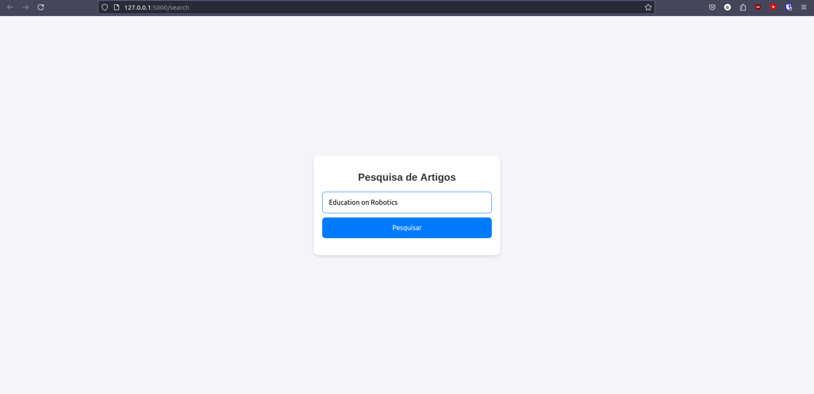
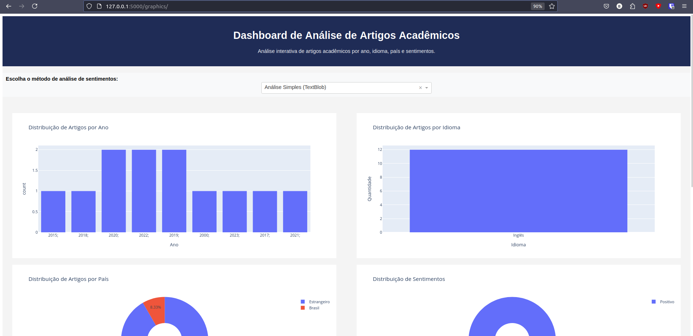
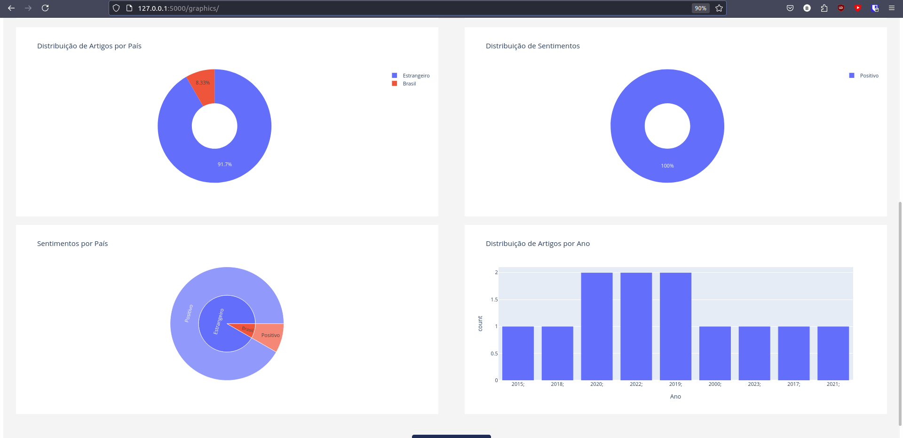

# hackaton-capes

Projeto de Pesquisa de Artigos Científicos com Scraping e Visualização
Descrição
Este projeto é uma aplicação web desenvolvida com Flask que permite aos usuários realizar pesquisas de artigos científicos. A aplicação utiliza técnicas de web scraping para coletar informações de artigos com base no título informado pelo usuário. Após a pesquisa, os resultados são apresentados em gráficos interativos para visualização e análise.

Funcionalidades
Pesquisa de Artigos:

O usuário pode inserir o título de um artigo e a aplicação realizará uma pesquisa através de web scraping.
Scraping e Armazenamento:

O scraping é realizado por uma função externa que coleta informações de artigos científicos e armazena os dados em um arquivo JSON.
Exibição de Gráficos:

Após o scraping, os dados são visualizados em gráficos interativos, permitindo uma análise mais profunda dos resultados.
Interface Responsiva:

A aplicação é construída para ser responsiva, proporcionando uma boa experiência de usuário em dispositivos móveis e desktop.
Tecnologias Utilizadas
Flask: Framework Python para construção da aplicação web.
Python: Linguagem de programação utilizada no backend.
HTML/CSS: Usados para a criação da interface do usuário.
JavaScript: Para a interatividade no frontend, incluindo o envio de requisições e manipulação do DOM.
Web Scraping: Utiliza técnicas de scraping para coletar dados de sites externos sobre artigos científicos.
Session Management: Armazenamento de dados temporários do usuário entre requisições.
JSON: Formato utilizado para armazenar e compartilhar os resultados do scraping.

Clone o repositório e entre na pasta do projeto
```bash
git clone https://github.com/Titan-Dev-RN/hackaton-capes.git
cd hackaton-capes
```

Usar um ambiente container (opcional)
```bash
python -m venv venv && source venv/bin/activate
```

Baixe as depêndencias:
```bash
pip install -r requirements.txt
```

Rodar o projeto:
```bash
python index.py
```

Acesse a url: http://127.0.0.1:5000

1 - Escreva o termo de busca no campo de texto e pesquise


2 - Espere ser redirecionado para a tela de dashboards 



